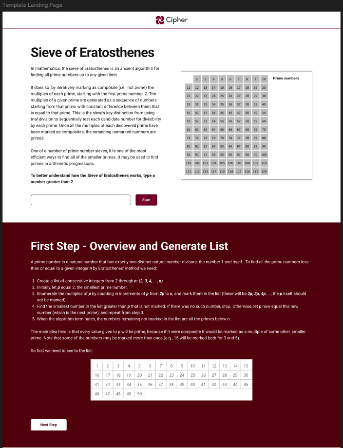
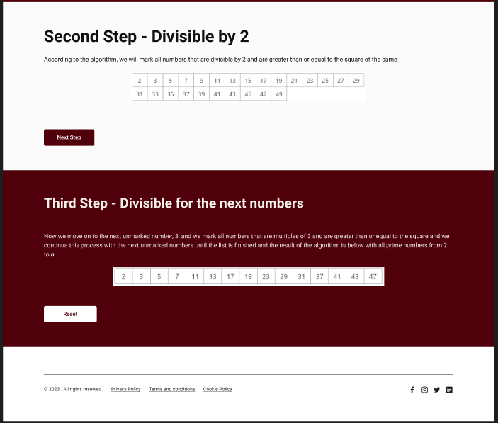

<h1 align="left">Project Sieve of Eratosthenes</h1>

###

This project is intended to be part of my portfolio. With this project, I intend to improve my basic React skills by creating a landpage that teaches how the Eratosthenes sieve algorithm works.

###

<h3 align="left">What is the Sieve of Eratosthenes?</h3>

###

The Sieve of Eratosthenes is a method for determining all prime numbers less than or equal to a certain number. The word “sieve” refers to a tool used to separate different components of a mixture, retaining larger substances and letting smaller ones pass through.

###

<h2 align="left">Figma</h2>

###

###

<h2 align="left">I code with</h2>

###

  
  
  
  
  
  
  
  
  

###